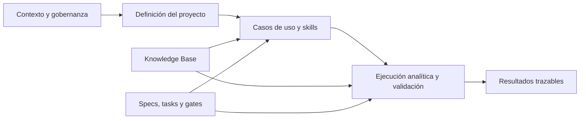

# VCA IA

## Plataforma Analítica basada en IA

Version estable: v1.0.0

Estado del proyecto: Development Authorized.

VCA IA es la plataforma de análisis asistido por IA de VCA para transformar contexto, datos y conocimiento del negocio en análisis trazables, conclusiones fundamentadas y recomendaciones reutilizables.

El proyecto se apoya en AIF Foundation como dependencia metodológica reutilizable, pero su objeto es VCA IA y no la Foundation.

---

## Proposito del repositorio

El repositorio existe para gobernar y documentar la Plataforma Analítica basada en IA de VCA.

Su propósito es proporcionar una base documental clara para:

- estructurar el trabajo analítico de VCA;
- conservar trazabilidad entre contexto, evidencia, razonamiento y salida;
- reutilizar capacidades analíticas sobre múltiples casos de uso;
- mantener separadas las responsabilidades entre datos, análisis, interpretación y recomendación;
- coordinar la evolución del proyecto mediante artefactos SDD oficiales.

El objetivo no es automatizar informes.
El objetivo es sostener un sistema analítico coherente, auditable y reutilizable para VCA.

---

## Que problema resuelve

VCA IA resuelve la fragmentación de los procesos analíticos cuando dependen de instrucciones ad hoc, decisiones implícitas y artefactos aislados que no conservan trazabilidad entre contexto, evidencia, razonamiento y resultado.

El proyecto busca reducir:

- la dispersión del contexto entre documentos y conversaciones;
- la variación del razonamiento entre ejecuciones o responsables;
- la mezcla entre evidencia e interpretación;
- la pérdida de trazabilidad entre fuentes y conclusiones;
- la dependencia de conocimiento tácito para evolucionar el sistema.

---

## Que objetivo persigue

El objetivo de VCA IA es sostener un sistema analítico corporativo capaz de trabajar desde el contexto inicial hasta las conclusiones y recomendaciones, con trazabilidad documental suficiente para revisar decisiones y reutilizar criterios.

Sabremos que el proyecto ha tenido exito cuando VCA disponga de un sistema que:

- permita estructurar analisis repetibles con entradas, procesos y salidas definidos;
- conserve la separacion entre hechos, evidencia, interpretacion y recomendacion;
- haga visibles los criterios utilizados en cada analisis;
- pueda evolucionar sin perder coherencia documental;
- reutilice la metodología de AIF Foundation sin depender de ella como resultado funcional.

---

## Que capacidades proporciona

VCA IA proporciona un marco para:

- definir y ejecutar casos de uso analíticos de forma trazable;
- incorporar nuevas capacidades analíticas sin rehacer el núcleo metodológico;
- separar contexto, evidencia, análisis, razonamiento y recomendaciones;
- validar el avance del proyecto mediante gates documentales;
- sostener la evolución del sistema con una base de conocimiento reutilizable;
- usar AIF Foundation como base metodológica, no como resultado funcional.

### Capacidad inicial aprobada

- [analytical_use_cases/meta_lead_quality_analysis.md](analytical_use_cases/meta_lead_quality_analysis.md)
- [.github/skills/meta-lead-quality-analysis/SKILL.md](.github/skills/meta-lead-quality-analysis/SKILL.md)

### Cierre de AUC-001

- T-032 a T-039 completadas con artefactos verificables.
- T-039 registra validación MCP separada de la adquisición CLI de T-018.
- Resultado de cierre de AUC-001: Pass with observations.
- Este cierre es analítico/documental y no debe confundirse con el Phase Gate de entrada a Development.

---

## Como esta organizado el proyecto

### Vista funcional

El proyecto se organiza por responsabilidades funcionales y no como una única lista documental.

### Casos de uso analiticos

- [analytical_use_cases/meta_lead_quality_analysis.md](analytical_use_cases/meta_lead_quality_analysis.md)

### Skills

- [.github/skills/meta-lead-quality-analysis/SKILL.md](.github/skills/meta-lead-quality-analysis/SKILL.md)

### Planificacion

- [docs/tasks.md](docs/tasks.md)

### Gates

- [gates/spec-008-development-entry-phase-gate.md](gates/spec-008-development-entry-phase-gate.md)

### Knowledge Base

- [knowledge/client/](knowledge/client/)

### Otros artefactos relevantes

- [project_brief.md](project_brief.md)
- [docs/context_refs.md](docs/context_refs.md)
- [docs/glosario_terminos.md](docs/glosario_terminos.md)
- [sdd_readiness_assessment.md](sdd_readiness_assessment.md)
- [specs/](specs/)
- [.github/instructions/sdd.instructions.md](.github/instructions/sdd.instructions.md)
- [.github/copilot-instructions.md](.github/copilot-instructions.md)

---

## Source of Truth

La Source of Truth del proyecto se reparte entre los artefactos canónicos del repositorio:

| Fuente | Propósito |
| --- | --- |
| [project_brief.md](project_brief.md) | Definición del proyecto, propósito, alcance, límites y criterios de éxito |
| [docs/context_refs.md](docs/context_refs.md) | Índice oficial de contexto, decisiones y trazabilidad |
| [specs/](specs/) | Definición del lifecycle, boundaries, extensibilidad, contracts, gates y evaluaciones |
| [analytical_use_cases/meta_lead_quality_analysis.md](analytical_use_cases/meta_lead_quality_analysis.md) | Primer caso de uso analítico aprobado |
| [.github/skills/meta-lead-quality-analysis/SKILL.md](.github/skills/meta-lead-quality-analysis/SKILL.md) | Skill asociada al caso inicial y reutilizable como capacidad analítica |
| [docs/tasks.md](docs/tasks.md) | Backlog documental y gobernanza de trabajo del proyecto |
| [gates/spec-008-development-entry-phase-gate.md](gates/spec-008-development-entry-phase-gate.md) | Registro documental del Phase Gate de entrada a Development |
| [knowledge/client/](knowledge/client/) | Base de conocimiento del proyecto para contexto persistente y reutilizable |
| [README.md](README.md) | Visión general navegable del proyecto |
| AIF Foundation | Dependencia metodológica reutilizable |

---

## Arquitectura conceptual

VCA IA puede entenderse como un sistema organizado en cuatro niveles conceptuales:



- Contexto y gobernanza: [docs/context_refs.md](docs/context_refs.md), [.github/instructions/sdd.instructions.md](.github/instructions/sdd.instructions.md), [.github/copilot-instructions.md](.github/copilot-instructions.md).
- Definición del proyecto: [project_brief.md](project_brief.md).
- Capas analíticas: casos de uso, skills y Knowledge Base.
- Control documental: specs, tasks, gates y readiness assessment.

AIF Foundation permanece fuera del sistema como dependencia metodológica reutilizable.

---

## Templates reutilizables

Los templates más útiles para comprender o extender el proyecto son:

- [docs/templates/project_brief.template.md](docs/templates/project_brief.template.md)
- [docs/templates/context_refs.template.md](docs/templates/context_refs.template.md)
- [docs/templates/sdd_readiness_assessment.template.md](docs/templates/sdd_readiness_assessment.template.md)
- [docs/templates/contracts.template.md](docs/templates/contracts.template.md)
- [docs/templates/data_lineage.template.md](docs/templates/data_lineage.template.md)
- [docs/templates/extension_compatibility_dossier.template.md](docs/templates/extension_compatibility_dossier.template.md)

Templates de apoyo, disponibles para necesidades documentales más específicas:

- [docs/templates/retrospective_spec.template.md](docs/templates/retrospective_spec.template.md)
- [docs/templates/closure_review.template.md](docs/templates/closure_review.template.md)
- [docs/templates/system_overview.template.md](docs/templates/system_overview.template.md)
- [docs/templates/architecture_as_is.template.md](docs/templates/architecture_as_is.template.md)
- [docs/templates/copilot-instructions.template.md](docs/templates/copilot-instructions.template.md)
- [docs/templates/copilot-instructions-project.template.md](docs/templates/copilot-instructions-project.template.md)
- [docs/templates/AGENTS.template.md](docs/templates/AGENTS.template.md)

---

## Que artefactos constituyen la Source of Truth

1. [docs/context_refs.md](docs/context_refs.md)
2. [project_brief.md](project_brief.md)
3. [specs/](specs/)
4. [analytical_use_cases/meta_lead_quality_analysis.md](analytical_use_cases/meta_lead_quality_analysis.md)
5. [.github/skills/meta-lead-quality-analysis/SKILL.md](.github/skills/meta-lead-quality-analysis/SKILL.md)
6. [docs/tasks.md](docs/tasks.md)
7. [gates/spec-008-development-entry-phase-gate.md](gates/spec-008-development-entry-phase-gate.md)
8. [knowledge/client/](knowledge/client/)

---

## Fase SDD actual

Estado vigente:

- SDD -> Development.

Autorizacion emitida mediante SPEC-008:

- PASS WITH OBSERVATIONS.

El proyecto puede avanzar en Development manteniendo visibles las observaciones activas registradas en el Phase Gate.

La fase documental previa ya quedó consolidada; a partir de aquí, la evolución debe seguir el control metodológico publicado y la trazabilidad entre artefactos.

---

## Como debe evolucionar el proyecto

La evolución de VCA IA debe seguir este orden general:

1. Consolidar contexto y definición del proyecto.
2. Formalizar o ampliar Specifications cuando aparezcan nuevas capacidades.
3. Mantener actualizados los casos de uso, skills y la Knowledge Base.
4. Planificar el trabajo en [docs/tasks.md](docs/tasks.md).
5. Validar la entrada a nuevas fases mediante gates documentales.
6. Desarrollar capacidades manteniendo trazabilidad entre evidencia, análisis y resultados.
7. Revisar y extender el sistema sin romper el núcleo analítico.

---

## Flujo recomendado

```text
Context References
↓
Project Brief
↓
Knowledge Base
↓
Specifications
↓
Casos de uso y Skills
↓
Tasks
↓
Development
↓
Validation
```

---

## Estructura del repositorio

```text
AGENTS.md
README.md

.github/
├── agents/
├── instructions/
├── prompts/
├── copilot-instructions.md
└── skills/

analytical_use_cases/
└── meta_lead_quality_analysis.md

docs/
├── glosario_terminos.md
├── context_refs.md
├── tasks.md
├── handoffs/
└── extension_dossiers/

knowledge/
└── client/

docs/templates/
├── project_brief.template.md
├── context_refs.template.md
├── sdd_readiness_assessment.template.md
├── contracts.template.md
├── data_lineage.template.md
├── extension_compatibility_dossier.template.md
├── retrospective_spec.template.md
├── system_overview.template.md
├── architecture_as_is.template.md
├── copilot-instructions.template.md
├── copilot-instructions-project.template.md
└── AGENTS.template.md

specs/
├── spec-001-analytical-lifecycle.md
├── spec-002-component-boundaries.md
├── spec-003-extensibility-model.md
├── spec-004-transversal-contracts.md
├── spec-005-readiness-gates.md
├── spec-006-documentary-evaluations.md
├── spec-007-extension-compatibility-reusability.md
├── spec-008-development-entry-phase-gate.md
└── templates/

gates/
├── spec-008-development-entry-phase-gate.md
memory/
tests/
tools/
workflows/
```

---

## Forma de trabajo esperada

- Mantener separacion entre metodología, gobernanza y ejecución futura.
- Crear artefactos reutilizables, no instancias especificas de cliente.
- Marcar ausencias de contexto como PENDING cuando corresponda.
- Evitar duplicar contenido ya cubierto por otro artefacto canonico.
- Priorizar claridad, trazabilidad y coherencia documental.
- Tratar AIF Foundation solo como dependencia metodologica reutilizable.

---

## Criterios de exito

VCA IA sera util cuando:

- el proyecto pueda explicarse sin conocer previamente AIF Foundation;
- el primer caso analitico aprobado pueda ejecutarse de forma trazable;
- nuevas capacidades puedan incorporarse sin romper el marco comun;
- la evidencia y la interpretacion permanezcan separadas;
- el repositorio sirva como base comun para evolucionar el sistema analitico de VCA.

---

## Siguiente paso recomendado

Proceder con la evolución del proyecto siguiendo el Phase Gate aprobado y las observaciones activas registradas en [gates/spec-008-development-entry-phase-gate.md](gates/spec-008-development-entry-phase-gate.md).
