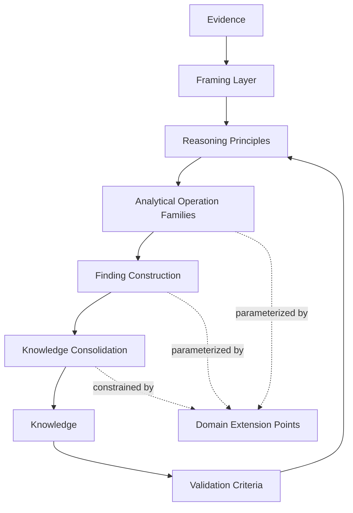

# Knowledge Construction Blueprint - Conceptual Model

## 1. Purpose

The Knowledge Construction Blueprint defines the internal conceptual architecture of the future AUC-001 experimental artifact that will shape how knowledge is constructed during Knowledge Generation.

It exists to structure the experiment, not to define concrete analytical operations, domain rules, or final content.

Its role is to provide a stable conceptual model that can later be instantiated for AUC-001 and compared with other cases without modifying Foundation.

## 2. Design Principles

The blueprint is governed by the following principles:

- Separate reasoning structure from domain content.
- Keep experimental guidance distinct from canonical workflow artifacts.
- Make the model comparable across future AUCs.
- Keep the profile interpretable before it becomes operational.
- Preserve traceability from evidence to knowledge without collapsing intermediate reasoning.
- Allow domain specialization only at explicit extension points.
- Avoid encoding final rules inside the conceptual layer.

## 3. Conceptual Components

The blueprint is composed of seven conceptual blocks.

### 3.1 Framing Layer

Defines the conceptual boundary of the profile.

### 3.2 Reasoning Principles

Defines the stable principles that govern how knowledge construction should be approached.

### 3.3 Analytical Operation Families

Defines abstract categories of analytical transformation, without enumerating concrete operations.

### 3.4 Finding Construction

Defines how partial analytical results are shaped into intermediate findings.

### 3.5 Knowledge Consolidation

Defines how intermediate findings are stabilized into Knowledge.

### 3.6 Validation Criteria

Defines the conceptual criteria used to judge whether the constructed knowledge is sufficiently sound.

### 3.7 Domain Extension Points

Defines where the profile can later accept domain-specific parameterization without changing the base model.

## 4. Component Responsibilities

### 4.1 Framing Layer

What it does:

- Sets the boundary of the profile.
- Separates experimental posture from canonical artifacts.
- Declares what the blueprint is and is not.

What it does not do:

- Define analytical content.
- Define domain rules.
- Define operational procedures.

Consumes:

- Architectural intent.
- Lifecycle constraints.
- Contract boundaries.

Produces:

- Conceptual scope.
- Structural boundary.
- Applicability limits.

### 4.2 Reasoning Principles

What it does:

- Establishes the reasoning posture of the blueprint.
- Provides invariants for how later reasoning should behave.
- Keeps the profile coherent across different evidence sets.

What it does not do:

- Perform reasoning itself.
- Generate findings.
- Replace quality criteria.

Consumes:

- Framing constraints.
- Contractual invariants.

Produces:

- Reasoning orientation.
- Stability expectations.
- Conceptual guardrails.

### 4.3 Analytical Operation Families

What it does:

- Groups the kinds of transformation the profile may need.
- Organizes analysis conceptually before it becomes concrete.
- Makes the model extensible without binding it to a single AUC.

What it does not do:

- List concrete operations.
- Decide operational sequencing.
- Define metrics or thresholds.

Consumes:

- Evidence abstractions.
- Reasoning principles.

Produces:

- Intermediate analytical structure.
- Operation family boundaries.

### 4.4 Finding Construction

What it does:

- Shapes intermediate analytical results into findings.
- Preserves interpretive distance from raw evidence.
- Enables reasoning to accumulate before consolidation.

What it does not do:

- Finalize knowledge.
- Restate evidence.
- Issue recommendations.

Consumes:

- Analytical outputs.
- Structural context from the operation families.

Produces:

- Intermediate findings.
- Candidate interpretive statements.

### 4.5 Knowledge Consolidation

What it does:

- Stabilizes findings into the Knowledge layer.
- Separates tentative interpretation from consolidated knowledge.
- Preserves traceability to the source evidence and findings.

What it does not do:

- Redefine Knowledge as a new lifecycle stage.
- Replace evidence.
- Introduce unrelated outputs.

Consumes:

- Intermediate findings.
- Framing and reasoning principles.

Produces:

- Knowledge candidates.
- Consolidated knowledge statements.

### 4.6 Validation Criteria

What it does:

- Defines the conceptual checks that assess whether knowledge construction is acceptable.
- Creates a gate between provisional interpretation and usable knowledge.
- Supports comparison between baseline and experiment.

What it does not do:

- Become a contract.
- Operate as runtime enforcement.
- Define implementation tests.

Consumes:

- Consolidated knowledge.
- Construction trace.

Produces:

- Validation status.
- Quality signals.
- Rejection or acceptance conditions at the conceptual level.

### 4.7 Domain Extension Points

What it does:

- Identifies where future AUCs can plug in their own semantics.
- Keeps the model reusable without hard-coding Meta Ads behavior.

What it does not do:

- Contain the domain semantics itself.
- Modify the base architecture.

Consumes:

- Base conceptual model.
- Future AUC parameters.

Produces:

- Parameter slots.
- Domain adaptation surfaces.

## 5. Relationships Between Components

The conceptual flow is layered rather than linear only.

Framing Layer

↓

Reasoning Principles

↓

Analytical Operation Families

↓

Finding Construction

↓

Knowledge Consolidation

↓

Validation Criteria

The flow is not one-way only.

Validation Criteria can feed back into the earlier layers when the construction is not yet stable enough to become Knowledge.

Domain Extension Points intersect the operation and consolidation layers but do not replace them.

## 6. Information Flow

The blueprint distinguishes information classes instead of treating everything as the same artifact.

Evidence enters as input.

Reasoning principles constrain interpretation.

Analytical operation families transform evidence into structured analytical material.

Finding construction turns that material into intermediate findings.

Knowledge consolidation stabilizes the findings into Knowledge.

Validation criteria assess whether the resulting Knowledge is sufficiently coherent, traceable, and usable.

The information flow can be represented as:

Evidence
↓
Analytical Structure
↓
Intermediate Findings
↓
Consolidated Knowledge
↓
Validation Signals

## 7. Interaction with Existing Artifacts

### AUC

The AUC defines the domain, purpose, and analytical intent.

The blueprint must not redefine the AUC. It only receives the AUC as contextual input.

### Skill

The Skill remains the operational extension point that activates the experiment when needed.

The blueprint must not absorb execution behavior.

### Runbook

The Runbook remains the procedural path for the workflow.

The blueprint can be referenced by the Runbook, but it must not replace it.

### Contracts

Contracts define the invariants that the blueprint must respect.

The blueprint may organize reasoning around those invariants, but it cannot rewrite them.

## 8. Domain-independent Components

The following components are domain-independent:

- Framing Layer;
- Reasoning Principles;
- Knowledge Consolidation;
- Validation Criteria;
- structural relationship between evidence and knowledge.

These components should remain stable across AUCs so that future comparisons are possible without changing Foundation.

## 9. Domain-dependent Extension Points

The following areas are expected to be parameterized later for Meta Ads:

- Analytical Operation Families;
- Finding Construction patterns;
- domain-specific semantic interpretation of intermediate findings;
- validation expectations that depend on the case context;
- any later selection of evidence categories relevant to the AUC.

These are extension points, not base components.

## 10. Conceptual Diagram

## 11. Open Questions

The following questions remain open at the conceptual level:

- Which analytical operation families are truly domain-independent?
- Which components require only light parameterization versus full specialization?
- How much validation should occur before Knowledge is considered stable?
- What is the minimum shared structure needed to compare this blueprint with future AUCs?
- Which parts should remain in the blueprint versus being delegated to the Runbook when the experiment is activated?

## 12. Design Decisions

The blueprint adopts the following decisions:

- It is a conceptual model, not an operational guide.
- It separates reasoning structure from domain semantics.
- It uses intermediate findings as a distinct layer between analysis and Knowledge.
- It treats validation as a conceptual quality layer, not as a runtime control.
- It keeps domain-specific behavior behind explicit extension points.
- It remains comparable across future AUCs without changing Foundation.

## 13. Conclusion

The Knowledge Construction Blueprint should be modeled as a layered conceptual architecture with clear separation between framing, reasoning posture, analytical structuring, finding construction, knowledge consolidation, validation, and domain extension.

This structure is sufficiently abstract to remain reusable and sufficiently concrete to guide the future experimental content of the profile.

It does not yet define the content of the profile.

It defines the shape of the profile so that the next step can fill it safely.